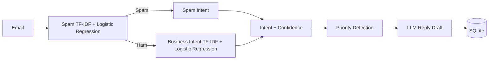

# AI Mail Responder

## Overview

AI Mail Responder is a compact NLP backend that classifies incoming emails, assigns an explainable priority, drafts a professional response, and stores the result. It combines a real scikit-learn model with FastAPI, SQLAlchemy, SQLite, and optional LLM generation. Drafts are never sent automatically.

## Architecture



## Features

- Two-stage classification: spam detection followed by five-class business intent prediction
- Explainable low, normal, or high priority rules
- OpenAI reply drafting with a local fallback when no API key is set
- SQLite persistence, validated APIs, Swagger docs, training evaluation, and tests

## Tech Stack

Python, FastAPI, scikit-learn, TF-IDF, Logistic Regression, SQLAlchemy, SQLite, OpenAI Responses API, and Pytest.

## ML Pipeline

The subject and body are joined, lowercased, and whitespace-normalized. A word TF-IDF and Logistic Regression model first predicts `spam` or `ham`. Spam exits early; ham continues to a character n-gram TF-IDF and Logistic Regression model for `inquiry`, `support`, `complaint`, `refund`, or `sales`. The selected class probability is returned as confidence.

## Intent Classes

`inquiry`, `support`, `complaint`, `refund`, `sales`, `spam`

## Model Evaluation

`python scripts/train_model.py` creates real metrics in `models/metrics.json` using reproducible stratified 80/20 splits.

<!-- METRICS_START -->
### Spam detector

The source contains 5,572 rows. Training removes exact duplicate messages, samples exactly 5,000 unique rows with `random_state=42`, then creates a stratified 80/20 split: 4,000 training and 1,000 held-out test messages.

| Metric | Result |
|---|---:|
| Accuracy | 0.9850 |
| Macro precision | 0.9614 |
| Macro recall | 0.9709 |
| Macro F1 | 0.9661 |
| Spam precision | 0.9297 |
| Spam recall | 0.9520 |
| Spam F1 | 0.9407 |

Confusion matrix (rows and columns: ham, spam):

```text
[[866, 9],
 [  6, 119]]
```

### Business intent classifier

The 120 non-spam synthetic business emails use a separate stratified 80/20 split: 96 training and 24 held-out test emails.

| Metric | Result |
|---|---:|
| Accuracy | 0.8333 |
| Macro precision | 0.9000 |
| Macro recall | 0.8400 |
| Macro F1 | 0.8389 |

Full per-class reports and both confusion matrices are generated in `models/metrics.json`. Results describe these datasets only and are not production-performance claims.
<!-- METRICS_END -->

## Dataset

Spam detection uses the [UCI SMS Spam Collection](https://archive.ics.uci.edu/dataset/228/sms), created by Tiago Almeida and Jose Hidalgo, DOI `10.24432/C5CC84`. UCI publishes it under CC BY 4.0. The training script reads the local `spam_ham.txt`, removes exact duplicate messages before splitting, and uses a reproducible 5,000-message sample.

## API

| Method | Endpoint | Purpose |
|---|---|---|
| GET | `/health` | Service health |
| POST | `/predict` | Predict intent, confidence, and priority |
| POST | `/reply` | Generate and store a draft |
| GET | `/emails` | List processed emails |
| GET | `/emails/{id}` | Fetch one processed email |

## Example

```json
{"subject": "Refund not received", "body": "I requested a refund last week but have not received the amount yet."}
```

Runtime `/reply` output shape (confidence and draft are intentionally not fabricated):

```json
{
  "id": 1,
  "subject": "Refund not received",
  "body": "I requested a refund last week but have not received the amount yet.",
  "intent": "refund",
  "confidence": "<runtime value between 0 and 1>",
  "priority": "high",
  "generated_reply": "<generated or fallback draft>",
  "created_at": "<UTC timestamp>"
}
```

## Setup

```bash
git clone <your-repository-url>
cd ai-mail-responder
python -m venv .venv
source .venv/bin/activate  # Windows: .venv\Scripts\activate
python -m pip install -r requirements.txt
cp .env.example .env       # Windows: copy .env.example .env
python scripts/train_model.py
uvicorn app.main:app --reload
```

Open Swagger at `http://127.0.0.1:8000/docs`. `OPENAI_API_KEY` is optional; without it, `/reply` returns a documented template draft. Keep any real key only in `.env`.

## Testing

```bash
pytest -q
```

## Limitations

- The spam corpus contains SMS-style language, while incoming production emails may have different language and distribution.
- The five business intents still use a small synthetic demonstration dataset.
- Classification quality depends on training data, and confidence is not calibrated.
- Keyword priority can miss unfamiliar wording.
- LLM drafts vary and always require human review.

## Future Improvements

- Use a larger labelled dataset and calibrated probabilities.
- Add monitoring, Gmail integration, and a human feedback loop.

## How It Works

`/predict` validates an email and runs the saved spam detector first. Spam returns immediately; ham continues through the saved five-class business intent model. The API then applies transparent keyword priority rules. `/reply` also requests a concise LLM draft (or uses the fallback), stores the record in SQLite, and returns it. A human decides whether to send the draft.
